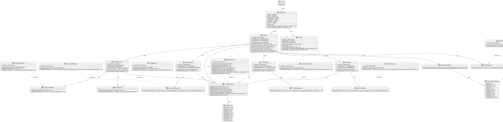
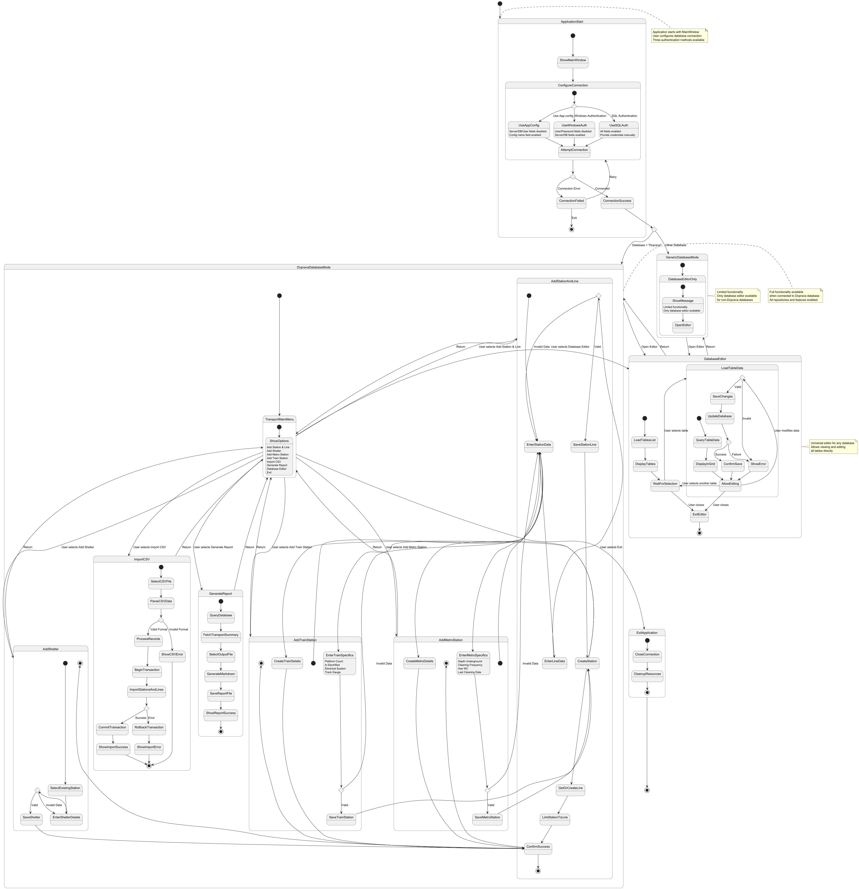

# DatabazeProjekt - Public Transport Database System

This application is a Windows Forms application for managing a public transport database ("Doprava"). It allows users to manage stations, lines, shelters, and view reports.

## Prerequisites

- **Microsoft SQL Server**: You need a running instance of MS SQL Server.
- **.NET 9.0**: The application targets .NET 9.0.

## Installation and Setup

1.  **Database Setup**:
    - Open Microsoft SQL Server Management Studio (SSMS).
    - Login to your SQL Server instance.
    - Update the connection string in `App.config` if necessary to match your server settings.
    - Open the `create-database.sql` script located in the root of this repository.
    - Execute the script to create the `doprava` database and its schema.

2.  **Application Setup**:
    - Open the solution `DatabazeProjekt.sln` in JetBrains Rider or Visual Studio.
    - Build the solution.

## Usage

### 1. Login Screen (MainWindow)
When you start the application, you will see the login screen. You have three options for connection:
- **App.config**: Uses the connection string defined in `App.config`.
- **Windows Authentication**: Connects using your current Windows credentials. You need to specify the Server and Database name.
- **SQL Authentication**: Connects using a specific SQL Username and Password.

Click **Load DB** to test the connection. If successful, the **Chooser** window will open.
Click **Doprava** to open the main Transport management interface directly.

### 2. Transport Management (Transport)
This is the main interface for the "Doprava" database.
- **Add Station & Line**: Manually add a new station and assign it to a line.
- **Add Shelter**: Add a shelter to an existing station.
- **Add Metro Station**: Add specific details for a metro station.
- **Import CSV**: Import station data from a CSV file.

#### CSV Import Format
The CSV file should use semicolon (`;`) as the delimiter by default. The expected columns are:

- `StationName` (string)
- `StationType` (string)
- `HasShelter` (boolean: true/false)
- `HasBench` (boolean: true/false)
- `HasTrashBin` (boolean: true/false)
- `HasInfoPanel` (boolean: true/false)
- `RequestStop` (boolean: true/false)
- `BarrierFree` (boolean: true/false)
- `LineNumber` (integer)
- `LineName` (string)

Example CSV content:

```
StationName;StationType;HasShelter;HasBench;HasTrashBin;HasInfoPanel;RequestStop;BarrierFree;LineNumber;LineName
Central Station;vlak;true;true;false;true;false;true;1;Main Line
Metro Stop;metro;false;true;true;false;true;false;2;Blue Line
```

- **Reports**: View summaries and reports.

### 3. Database Chooser (Chooser)
A generic database viewer that allows you to select any table in the database and view its content.
- Select a table from the dropdown to load its data.
- Views are read-only.

## Diagrams

### Class Diagram

*(See `Diagrams/class-diagram.puml`)*

### State Diagram

*(See `Diagrams/state-diagram.puml`)*

## ER Diagram

## Project Structure

- **Forms/**: Contains all Windows Forms (UI).
- **Repositories/**: Data access layer repositories.
- **Reports/**: Logic for generating reports.
- **Diagrams/**: PlantUML diagrams.
- **Blackbox testing/**: Test case documentation.
